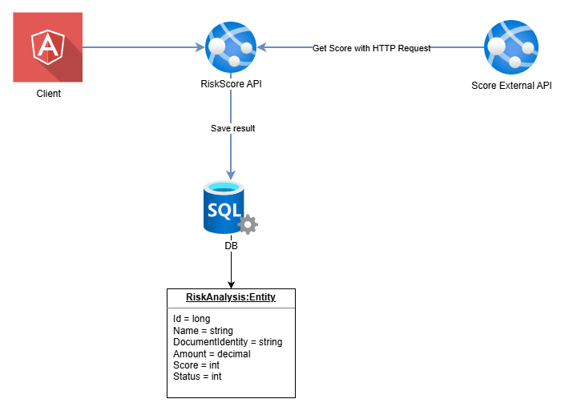

# RiskScore API

Sistema de validación de clientes con integración a servicios externos de scoring crediticio para la línea de crédito instantáneo "PayLater".

## 📋 Descripción

RiskScore API es un servicio que valida clientes contra el partner de scoring crediticio Reqres FinScore, aplicando reglas de negocio para aprobar o rechazar solicitudes de crédito en tiempo real.

### Reglas de Negocio

| Score | Condición | Resultado |
|-------|-----------|-----------|
| ≥ 700 | - | Aprobado |
| 500 - 699 | Monto < $1,000 | Aprobado |
| 500 - 699 | Monto ≥ $1,000 | Rechazado |
| < 500 | - | Rechazado |
| API sin respuesta | - | Rechazado (por seguridad) |

---

## 🛠️ Stack Tecnológico

- **Framework:** .NET 8 / .NET Framework 4.6.2 *(especificar)*
- **Base de Datos:** *(Entity Framework InMemory / SQL LocalDB / SQL Server Docker)*
- **Librerías adicionales:**
  - *(Polly - resiliencia)*
  - *(Serilog - logging)*
  - *(otras...)*

---

## 🧱 Arquitectura



---

## 🚀 Instrucciones de Ejecución

### Prerrequisitos

```
- .NET SDK X.X
- (otros prerrequisitos)
```

### Instalación

```bash
# Clonar repositorio
git clone [url-repositorio]

# Restaurar dependencias
dotnet restore

# Ejecutar aplicación
dotnet run --project src/RiskScore.Api
```

### Configuración

*(Describir variables de entorno o archivos de configuración necesarios)*

```json
{
  "ExternalApi": {
    "BaseUrl": "https://reqres.in/api",
    "ApiKey": "reqres-free-v1",
    "TimeoutSeconds": 30
  }
}
```

---

## 🏗️ Arquitectura

Ver documento detallado en [ARCHITECTURE.md](./ARCHITECTURE.md)

### Estructura del Proyecto

```
src/
├── RiskScore.Api/           # Capa de presentación (API)
├── RiskScore.Application/   # Lógica de negocio
├── RiskScore.Domain/        # Entidades y contratos
└── RiskScore.Infrastructure/ # Implementaciones externas (API, BD)

tests/
└── RiskScore.Tests/         # Tests unitarios
```

---

## ✅ Funcionalidades Implementadas

- [ ] Consumo de API externa (Reqres FinScore)
- [ ] Lógica de negocio (reglas de aprobación)
- [ ] Persistencia en base de datos
- [ ] Manejo de errores
- [ ] Logging estructurado
- [ ] Patrón de resiliencia (retry/circuit breaker)
- [ ] Validaciones de entrada
- [ ] Configuración externalizada

---

## 🧪 Tests

Pendientes como deuda tecnica.

---

## 📌 Decisiones Técnicas

### ¿Por qué [decisión]?

Se decidió crear un API 

### Patrones Utilizados

- ***(Patrón)*:** *(Justificación)*

---

## 🎯 Priorización

### Lo que implementé primero y por qué

1. ***(Funcionalidad)*:** *(Razón)*
2. ***(Funcionalidad)*:** *(Razón)*

### Lo que diferí para después

- *(Funcionalidad pendiente y cómo la habría resuelto)*

---

## 📝 Pendientes / Mejoras Futuras

- [ ] *(Mejora 1)*
- [ ] *(Mejora 2)*
- [ ] *(Mejora 3)*

---

## 👤 Autor

- **Nombre:** *(Tu nombre)*
- **Fecha:** *(Fecha de la prueba)*

---

## 📄 Licencia

Proyecto desarrollado como parte de prueba técnica para PaymentTech Solutions.
